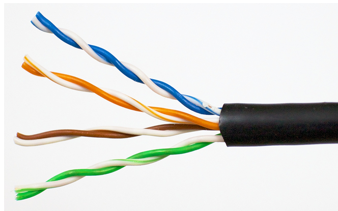

# Unshielded Twisted Pair Cable Considerations

## Summary

Unshielded cables have a polerized twisted pair of copper wires. Each twisted pair is twisted at a different frequency to reduce signal interferience from each other.

## Cross Talk

Cross talk occurs when one twisted pair interferes with another signal within a twisted pair. This can occur as a result of their close proximity or if they are untwisted or exposed.

## American Wire Gauge (AWG)

The American Wire Guage is the thickness of the copper piece that is used. The standard is between 22 and 24. Numbers that increase indicate a thinner wire.

## Sample Image

